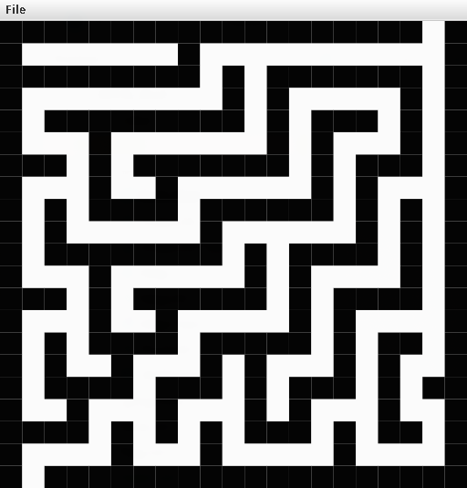

# Exercise 2

The project provides fully featured `Index2D` and `Map` classes that can be used to display maps/images as a grid on the
screen.

## Example:

See [here](https://docs.google.com/document/d/1BtSldHciAGqjccYC3d7BKvWqIljfxKeJ) for more info.

## Features:

- Flood fill
- BFS based shorted path algorithm
- Distance maps
- Rescaling

## Tasks:

- [x] Implement `Index2D.java`
- [x] Add `Index2DTest.java`
- [x] Implement the Map class in `Map.java` (based on the interface in `Map2D.java`), including tests and documentation
- [x] Implement the Ex2_GUI class in `Ex2_GUI.java` (use `StdDraw.java` from class 4, see below)
- [x] Complete `README.md` and add images of the output from `Ex2_GUI.java`
- [x] Make the repo public and submit the assignment

## Links:

- [BFS algorithm - wiki](https://en.wikipedia.org/wiki/Breadth-first_search)
- [BFS algorithm - video](https://ariel-ac-il.zoom.us/rec/share/EIvBXTVp37_HctRCSaN4H19Gv6eiR5ZUNM_GbWQwlAq2mRaUsMSkWGBMcgrbWRnF.-fwUWSO8wVrLaxbv?startTime=1669991178000)
- [StdDraw](https://github.com/benmoshe/Intro2CS_ArielU_2026A/blob/main/src/classes/week4/StdDrawTest.java)
- [Submission](https://moodlearn.ariel.ac.il/mod/assign/view.php?id=2212901)